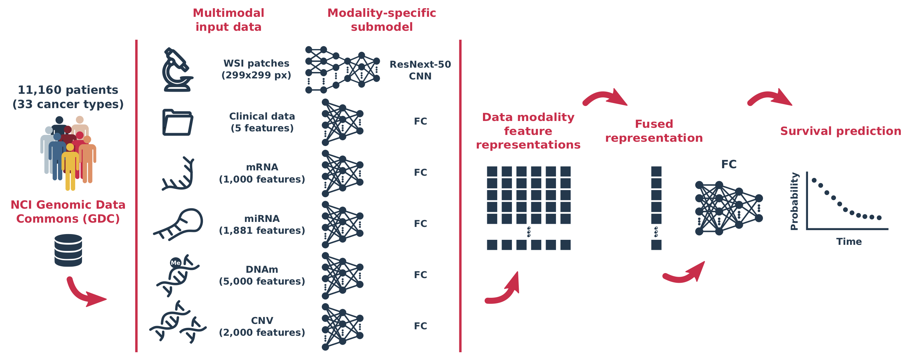

[![MIT License][license-shield]][license-url]
![GitHub All Releases][downloads-shield]

[license-shield]: https://img.shields.io/github/license/othneildrew/Best-README-Template.svg?style=flat-square
[license-url]: https://github.com/luisvalesilva/multisurv/blob/master/LICENSE
[downloads-shield]: https://img.shields.io/github/downloads/luisvalesilva/multisurv/total?style=flat-square

<h1 align="center">MultiSurv :page_facing_up:</h1>

  

  <strong><ins>Multi</ins>modal Deep Learning-based pan-cancer <ins>Surv</ins>ival prediction</strong>
  

  

     
    <a href="#using-the-code">Using the code</a>
    •
    <a href="#repo-structure">Repo structure</a>
    •
    <a href="#license">License</a>
    

 

---

This repository contains all code developed for the MultiSurv paper:

__MultiSurv: Long-term cancer survival prediction using multimodal deep learning__   |   [medRxiv]()

  

  

> __Usability note:__ This is experimental work, not a directly usable software library.
The code was developed in the context of an academic research project, highly
exploratory and iterative in nature. It is published here in the spirit of
open science and reproducibility values.

  

## Using the code

This project was built using the Anaconda distribution of Python 3.6.8. To run a fresh copy of the code, clone this repository and use the Anaconda environment manager to create an environment (from the `environment.yml` file provided here) to install the MultiSurv code dependencies.

For instructions on how to create and use conda environments, please refer to the [docs](https://conda.io/projects/conda/en/latest/user-guide/tasks/manage-environments.html#creating-an-environment-from-an-environment-yml-file) at conda.io.

## Repo structure

The source code is found in the [`src`](src/) directory. Higher-level or exploratory analyses,
as well as paper figures and tables, are typically run using Jupyter notebooks.

Non-exhaustive lists of links to some key parts of the project are found below.

### Basic components

| Content | Code source | Description |
|---|---|---|
| Data preprocessing code | [`data`](data/) directory | Separate Jupyter notebook files for different data modalities |
| MultiSurv model | [`multisurv.py`](src/multisurv.py) | Pytorch model |
| MultiSurv training | [`model.py`](src/model.py)   [Jupyter notebook](model_training.ipynb) | Python Class handling model training   Code to run training |
| MultiSurv evaluation | [Jupyter notebook](figures_and_tables/table-multisurv_evaluation.ipynb) | Evaluation of trained models after loading weights |
| Baseline model evaluation | [Jupyter notebook](figures_and_tables/table-baseline_evaluation.ipynb) | Fit and evaluate baseline models |

### Paper figures and tables

| Content | Files | Description |
|---|---|---|
| Table 1 - Unimodal data results | [Jupyter notebook](figures_and_tables/table-baseline_evaluation.ipynb)   [Jupyter notebook](figures_and_tables/table-multisurv_evaluation.ipynb)   [`results.csv`](figures_and_tables/results.csv) | Baseline model evaluation   MultiSurv evaluation   Result table |
| Table 2 - Multimodal data results | [Jupyter notebook](figures_and_tables/table-multisurv_evaluation.ipynb)   [`results.csv`](figures_and_tables/results.csv) | MultiSurv evaluation   Result table |
| Table 3 - Data summary | [Jupyter notebook](figures_and_tables/table-data_info.ipynb) | Overview of the different data modalities |
| Fig. 1 - Model architecture | [`MultiSurv.png`](MultiSurv.png) | Schematic overview of MultiSurv |
| Fig. 2 - Survival curves | [Jupyter notebook](figures_and_tables/figure-survival_curves.ipynb) | Predicted survival curves |
| Fig. 3 - Feature representations | [Jupyter notebook](figures_and_tables/figure-learned_representations.ipynb) | Feature representations and patient survival curves |

Code used to generate all additional material for the paper can be found in the [`figures_and_tables`](figures_and_tables/) directory.

## License

This project is licensed under the terms of the
[MIT](https://tldrlegal.com/license/mit-license) license. See
[LICENSE](LICENSE) file for details.
